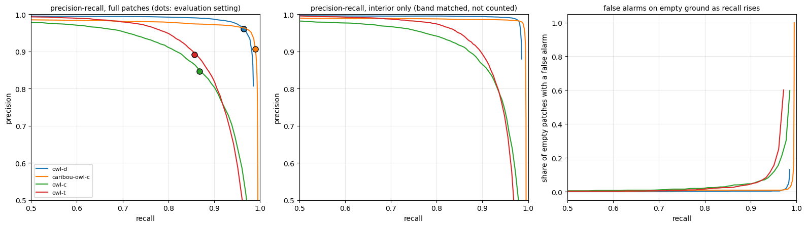
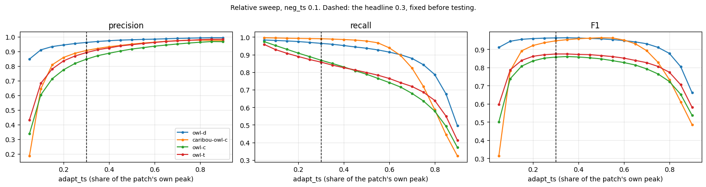
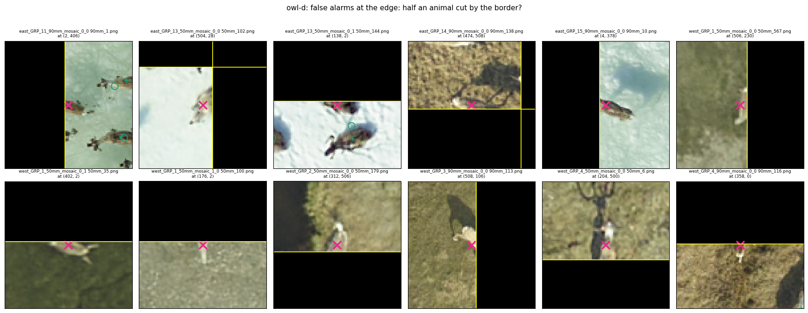
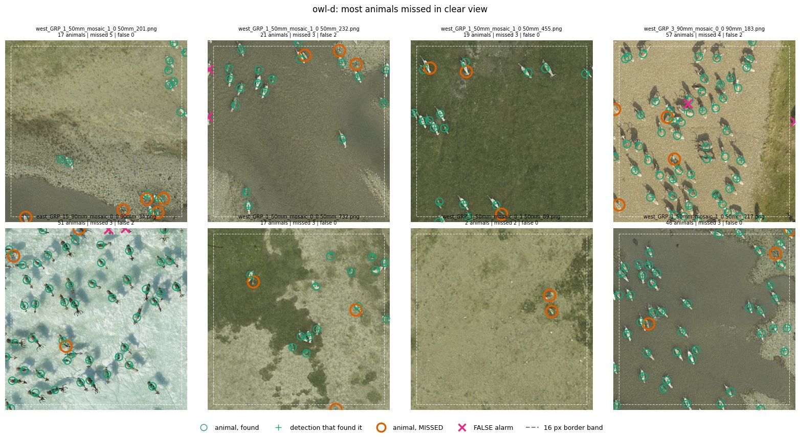
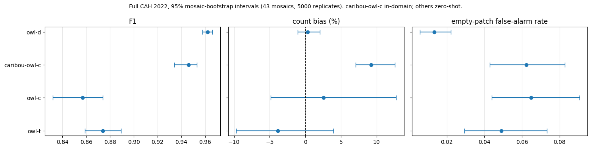

# owl-caribou-overhead

Cross-herd, cross-year evaluation of four overhead detection models (one
caribou-specific) on aerial survey imagery, with error bars, a failure analysis
and a threshold sweep.

- **Test domain (locked):** Central Arctic Herd (CAH), Alaska, 2022. 2,607
  patches of 512x512 px cut from 43 aerial mosaics, 12,456 annotated animals,
  one class (caribou). 755 patches contain no animals.
- **Development domain:** Porcupine Caribou Herd (PCH), Alaska, 2017, the
  training split of the same data release.
- **Interpretation:** different herds, areas and years. The results measure how
  well models transfer, not how the population changed.

## Findings

1. **The two best models show no measurable difference in detection quality.**
   Threshold-free, average precision is 0.978 for `owl-d` and 0.977 for
   `caribou-owl-c`; the paired difference over resampled mosaics is +0.001
   [-0.004, +0.008] (43 mosaics, 2,000 resamples). With the tile border left
   out of the count it is -0.003 [-0.008, +0.004]: still a tie.
2. **At the fixed evaluation setting, `owl-d` scores higher**, but that gap is
   an operating-point effect. The shared rule (keep a peak at least 30% of its
   patch's maximum; ignore a patch whose maximum is under 0.1) sits within
   0.001 of `owl-d`'s best F1 and is too permissive for `caribou-owl-c`, which
   then over-counts by 9%.
3. **`owl-d` is insensitive to the cut; `caribou-owl-c` is not.** `owl-d`'s F1
   stays above 0.95 for any relative cut from 0.15 to 0.55 (0.948 at 0.60).
   `caribou-owl-c` reaches 0.95 only between 0.35 and 0.60, which excludes the
   fixed 0.30. `owl-d` leaves about 8x fewer candidate peaks in its heatmaps
   (local maxima at or above 1% of the patch's peak: 381 k vs 3.1 M over the
   split).
4. **Half the errors sit in the tile border.** A 16 px band along each patch
   border is 12% of the area but holds 53% of `owl-d`'s errors. Inspected at
   full resolution, most "false alarms" there, and most false alarms away from
   any annotation, are real caribou the patch's ground truth does not list.
   Measured precision is therefore a lower bound for every model.
5. **`owl-t` and `owl-c` trail clearly** (average precision 0.927 and 0.919).

*Left: the `owl-d` and `caribou-owl-c` curves enclose the same area (finding
1): `owl-d` holds slightly higher precision, `caribou-owl-c` reaches higher
recall. The dots mark the fixed evaluation setting (finding 2). Middle: the
same with the border band left out of the count. Right: false alarms on empty
ground stay near zero for both until recall passes about 0.96. From
`06_sweep_curves`.*

*F1 as the relative cut varies (finding 3): `owl-d` stays flat around the fixed
0.3 (dashed); `caribou-owl-c` peaks later and falls off on both sides. From
`06_sweep_curves`.*

*`owl-d` false alarms in the border band (pink crosses), twelve from twelve
mosaics; the yellow line is the tile border. Most sit on a caribou cut by the
border and not annotated in this patch (finding 4). From
`04_failures`; survey imagery from the Zenodo release, CC BY-NC-SA 4.0, with
our detections and the release's annotations drawn on it.*

*The eight patches where `owl-d` missed the most animals in clear view
(orange circles; found animals are green, false alarms pink crosses, the
dashed line is the 16 px border band). These misses have no single cause:
fully visible adults, two close animals covered by one detection, and a few
points placed at the wrong end of the body. From `04_failures`; survey imagery
from the Zenodo release, CC BY-NC-SA 4.0, with our detections and the
release's annotations drawn on it.*

## Results at the evaluation setting

Radius 20 px, 95% intervals from a cluster bootstrap over the 43 source
mosaics (5,000 resamples).

| model | precision | recall | F1 | count bias | empty patches with a false alarm |
|---|---|---|---|---|---|
| `owl-d` | 0.961 | 0.964 | 0.962 [0.958, 0.966] | +0.31% [-1.05, +2.03] | 1.3% |
| `caribou-owl-c` | 0.906 | 0.990 | 0.946 [0.934, 0.953] | +9.26% [+7.06, +12.58] | 6.2% |
| `owl-t` | 0.891 | 0.857 | 0.874 [0.859, 0.889] | -3.85% [-9.67, +3.93] | 4.9% |
| `owl-c` | 0.846 | 0.868 | 0.857 [0.832, 0.874] | +2.55% [-4.86, +12.73] | 6.5% |

*The table's F1, count bias and empty-patch rate with their 95% intervals.
From `03_uncertainty`.*

Read this table together with the findings above: the differences between the
top two rows come mostly from the shared setting, not from detection quality.
The empty-patch gap (1.3% vs 6.2%) comes from the 0.1 floor, not from the 30%
cut: under the relative rule it is the same at every cut, and at equal recall
on the absolute sweep, up to about 0.96, both models stay near zero.

## Caveats that travel with every number

- We tuned no threshold on CAH: all four models are scored at the
  repository's shared 30% rule. `caribou-owl-c` is in-domain, and its
  documented confidence cut (not used here) was selected on CAH test
  patches; `owl-c`, `owl-t` and `owl-d` are used zero-shot. The comparison is
  asymmetric.
- Where a curve's best F1 appears, it was chosen on the test set and is an
  oracle bound, not a result.
- The ground truth is treated as exact. Judgements that a false alarm is a
  real animal were made by eye on twelve errors of each kind, spread over as
  many mosaics as the kind allows (twelve for every kind except false alarms
  on empty ground, of which only 16 exist, from eight mosaics). They show the
  problem exists and roughly how common it is, not its exact size.
- Mosaics were resampled as whole units; with 43 clusters the intervals are
  honest but somewhat optimistic. Mosaic names also carry a flight group above
  the mosaic, and mosaics from one group may share a flight.
- One source domain and one target domain: the transfer conclusion rests on a
  single domain shift.
- Average precision is integrated on a grid of score thresholds 0.01 apart,
  so each value is a slight underestimate of the exact area. How much depends
  on how each model's scores are spread, which differs between models, so a
  difference of about 0.001, like the one in finding 1, is within this
  approximation; it cannot turn the tie into a clear lead.

## How it was checked

- `00_probe` reproduces a 50-patch reference run, made earlier with the
  upstream evaluator on the same checkpoint: 231 detections, every point
  within 0.5 px. The reference table is not published; the notebook keeps the
  printed report.
- Before any interval is computed, the per-patch statistics are asserted to
  reproduce the pooled metrics to 1e-12 (`03_uncertainty`); the failure labels
  are asserted to sum exactly to the headline true positives, false alarms and
  misses (`04_failures`). Every no-GPU notebook first checks that all four
  models' detections are complete and come from one run of one code version.
- The threshold sweep stores every candidate peak down to 1% of each patch's
  maximum; replaying the evaluation setting from those candidates reproduced
  the full run on all 2,607 patches for all four models.
- Checkpoints are checked against their published MD5 before every load
  (hashed on first use, then a size-checked marker). The split archive is
  verified by MD5 when it is staged (`05_sweep_gpu`) and by file and point
  counts before each GPU run; the no-GPU notebooks only check that `gt.csv`
  is present. Nothing is downloaded by the code.
- The committed outputs were produced on Colab with an NVIDIA A100 (40 GB),
  Python 3.13.15, torch 2.11.0+cu128 and CUDA 12.8, at PyTorch's defaults:
  fp32 inputs, with TF32 convolutions on this GPU class. The code hash printed
  in every notebook is the hash of the committed code.

## Models and data

Four public checkpoints and the CAH split come from one data release, Zenodo
record [20802844](https://doi.org/10.5281/zenodo.20802844) (Chacón Silva et
al., 2026, CC BY-NC-SA 4.0), published with the paper *Overhead Wildlife
Locator (OWL): Benchmarking Weakly Supervised Learning for Aerial Wildlife
Surveys* (2026) and the
[MegaDetector-Overhead](https://github.com/microsoft/MegaDetector-Overhead)
repository. All four are heatmap point detectors of the HerdNet family
(University of Liège):

| checkpoint | backbone | role here |
|---|---|---|
| `owl-c` | DLA-34 | general overhead model, zero-shot |
| `owl-t` | DLA-34 with Swin transformer blocks refining its feature maps | general overhead model, zero-shot |
| `owl-d` | DINOv3 ViT-H+/16 (Meta), frozen | general overhead model, zero-shot |
| `caribou-owl-c` | DLA-34, same architecture as `owl-c` | caribou-specific, the in-domain reference |

Evaluation is at a matching radius of 20 px (40 px changes F1 by at most
0.005 for every model), with the release's operating point: local maxima of
the heatmap kept at or above 30% of the patch's maximum, patches with a
maximum under 0.1 treated as empty, greedy one-to-one matching.

### Expected assets

The code downloads nothing. Place the release files like this (the notebooks
point `ASSETS` and `RESULTS` at these two folders and check for `gt.csv`
before running):

    ASSETS/                          default: /content/drive/MyDrive/OWL_Caribou_Project
      cache/weights/OWL-C.pth, OWL-T.pth, OWL-D.pth, Caribou-OWL-C.pth
      cache/archives/test.zip        only 05_sweep_gpu reads it (staged to local disk)
      data/test/gt.csv               test.zip unpacked so gt.csv sits next to the patches
      data/test/*.png                the 2,607 patches
    RESULTS/                         default: /content/drive/MyDrive/owl_caribou_overhead/results
                                     written by the notebooks; not in the repository

The digests the code checks against are in `src/owlcaribou/io.py`. The first
run writes a small `<name>.verified.json` next to each checkpoint so later runs
can skip re-hashing 4.3 GB; if `ASSETS` is read-only, the checkpoints are
simply hashed again on every run.

## Running it

The notebooks are written for VS Code with the Google Colab extension: open a
notebook locally, connect it to a Colab runtime, and the cells run there. The
runtime cannot see local disk, so the code travels inside one notebook cell:

    pip install -e .                      # once, locally
    python -m owlcaribou.sync             # pack src/ and third_party/ into every notebook
    python -m owlcaribou.sync --check     # exit 1 if a notebook carries stale code or has no sync cell
    python -m owlcaribou.sync --clear     # empty the cells again, before committing

`--check` reports an emptied cell as `empty` and does not fail on it: an empty
cell stops the notebook with a message, so it cannot run old code.

Run `sync` after every code edit. If you use the Colab website instead, run
`sync`, upload the notebook (its sync cell is then about 170 KB) and re-upload
after any code change. Commit notebooks with **empty** sync cells: the code
belongs in `src/` once. The code hash is printed locally and again on the
runtime; if the two differ, the runtime is running old code.

Order, and what each notebook needs:

| notebook | needs | purpose |
|---|---|---|
| `00_probe` | GPU | optional: reproduce the reference run (needs the unpublished table; skip section 5 without it) and time the three architectures |
| `01_full_cah` | GPU, about 15-20 min | all four models over the full split; writes detections only |
| `02_metrics` | no GPU | precision, recall, F1, counting error, empty-patch false alarms |
| `03_uncertainty` | no GPU | error bars by resampling source mosaics; paired model comparisons |
| `04_failures` | no GPU | where errors happen and why, with zoomed crops for checking by eye |
| `05_sweep_gpu` | GPU, about 6-7 min | every candidate peak, stored and checked against the full run |
| `06_sweep_curves` | no GPU | relative and absolute sweeps, precision-recall, average precision |

The no-GPU notebooks read what `01` and `05` wrote to `RESULTS/`, so run `01`
first, and `05` before `06`. The code accepts any CUDA GPU of compute
capability 7 or newer (T4, L4, A100); the committed outputs came from an A100.

## Layout

    src/owlcaribou/   the pipeline: data, inference, peak extraction, metrics,
                      uncertainty, failure analysis, threshold sweep
    third_party/      upstream model definitions, only so the checkpoints load
    notebooks/        Colab entry points, driven from VS Code

All pipeline, evaluation and reporting code was written for this project. Two
parts deliberately re-implement the upstream evaluator so that the numbers stay
comparable with it: the peak rule (local maxima, relative cut, absolute floor)
and the greedy radius matching. `third_party/` holds the upstream model
definitions byte for byte (one short `__init__.py` is ours) and is about twice
the size of our own code; see `third_party/README.md` for provenance. Nothing
calls out to a third party at run time: no experiment tracking, no telemetry,
no downloads, no credentials.

## Licence

- Our code (`src/`, `notebooks/`, the top-level files, `third_party/README.md`
  and `third_party/animaloc/__init__.py`) and the plots in `docs/`: MIT, see
  `LICENSE`, except `docs/edge_false_alarms.png` and
  `docs/missed_in_clear_view.jpg` (below).
- `third_party/animaloc/`: MIT, (C) 2024 University of Liège, Gembloux
  Agro-Bio Tech, Forest Is Life (Alexandre Delplanque), distributed in
  Microsoft's MegaDetector-Overhead repository (MIT, (C) 2026 Microsoft);
  `models/dla.py` is MIT, (c) 2019 Xingyi Zhou.
- `third_party/dinov3/`: the DINOv3 License (Meta), **not MIT**. It permits
  redistribution with a copy of the licence, which is included, restricts some
  uses, among them trade-controlled and military use, and asks that published
  results acknowledge DINOv3. The `owl-d` checkpoint carries DINOv3 encoder
  weights, so the same licence applies to anyone who runs `owl-d`.
- Checkpoints and the CAH data:
  [CC BY-NC-SA 4.0](https://creativecommons.org/licenses/by-nc-sa/4.0/), from
  the Zenodo record above, so any use of this pipeline with them must be
  non-commercial, and anything derived from them must be shared under the
  same licence. The ten figures in `notebooks/04_failures.ipynb` (four
  galleries of whole patches, six grids of zoomed crops),
  `docs/edge_false_alarms.png` (one of those grids) and
  `docs/missed_in_clear_view.jpg` (one of those galleries) show that data with
  its annotations and our detections drawn on it; they are shared under
  CC BY-NC-SA 4.0, not under MIT.

## References

- I. D. Chacón Silva, Z. Miao, B. Demuro, C. Robinson, R. Dodhia,
  L. Otarashvili, J. Holmberg, K. Larsen, H. Frederick, N. J. Pamperin,
  P. Arbeláez, J. M. Lavista Ferres. *Overhead MegaDetector - OWL (Overhead
  Wildlife Locator) Benchmark - Models and Caribou Data*, version 3, Zenodo,
  2026. https://doi.org/10.5281/zenodo.20802844
- *Overhead Wildlife Locator (OWL): Benchmarking Weakly Supervised Learning
  for Aerial Wildlife Surveys*, 2026, as listed in that record.
- MegaDetector-Overhead: https://github.com/microsoft/MegaDetector-Overhead
- DINOv3 (Meta): https://github.com/facebookresearch/dinov3; licence in
  `third_party/dinov3/LICENSE.md`.
